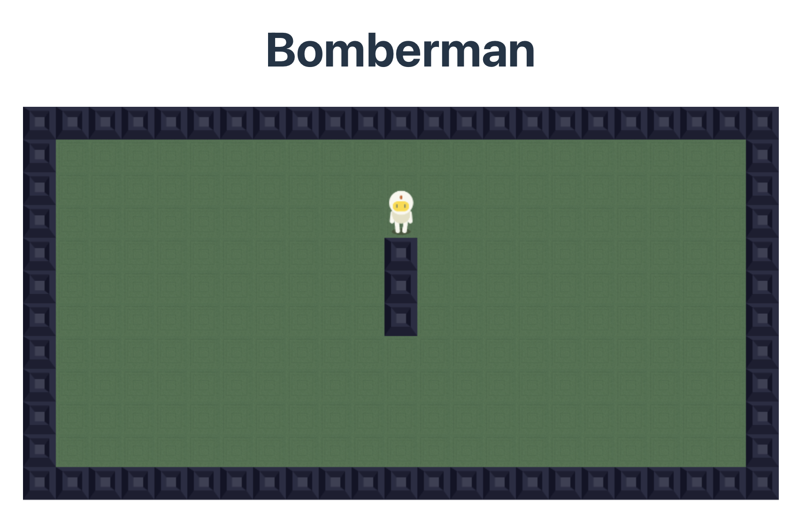

# Bomberman TS

typescript implementation of the bomberman game

## screenshot

## local development

### prerequisites

- node.js
- pnpm

### installation

- clone the repository
- install dependencies with `pnpm install`
- start the development server with `pnpm dev`
